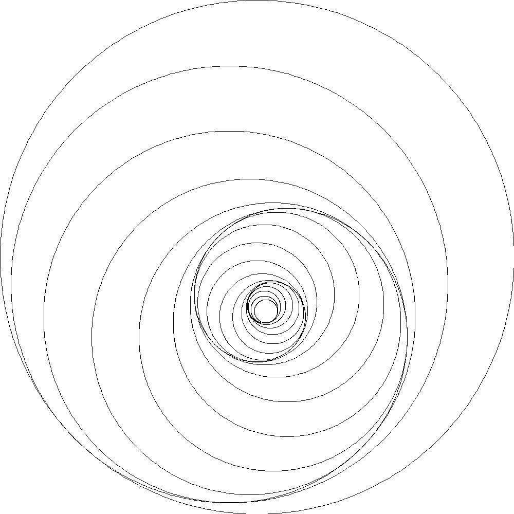

# TP - 2D pattern generation

by Sami AMARA and Denis PETIT.

## Description
Practical school assignment on sequences and series in the complex field, applied to 2D pattern drawing.

## Where to start?

The report of this practical work is in [GP2_2020_2021_Complex_Szen_AmaraPetit.pdf](GP2_2020_2021_Complex_Szen_AmaraPetit.pdf).
For further explanations about the architecture of this project, see the "Annexes" section at the end of the report.
